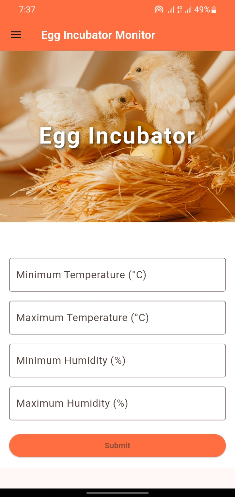
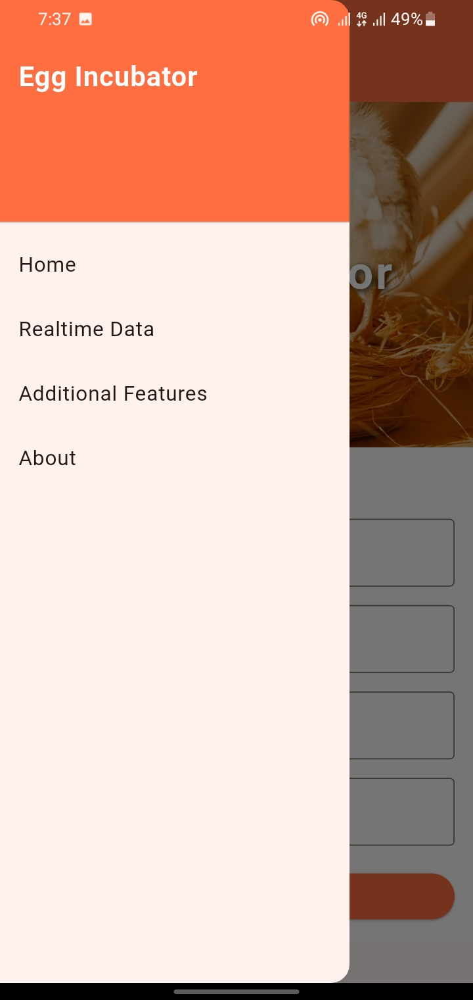

# Egg Incubator Monitoring and Control System

This project is a comprehensive system for monitoring and controlling an egg incubator. It includes a Flutter-based mobile application, a Node.js backend, and firmware for an ESP32 microcontroller. The system allows users to monitor temperature and humidity in real-time, control a DC motor for egg turning, and receive notifications.

## Screenshots

<table>
  <tr>
    <td>
      
      <br>
      <em>Dashboard</em>
    </td>
    <td>
      
      <br>
      <em>Menu</em>
    </td>
  </tr>
</table>


## Features

*   **Real-time Monitoring:** Track temperature and humidity data from the incubator.
*   **Motor Control:** Control a DC motor for automatic egg turning.
*   **Notifications:** Receive alerts for critical temperature or humidity levels.
*   **Data Logging:** Store sensor data for analysis and prediction.
*   **Cross-Platform:** The Flutter app runs on Android, iOS, and web.

## System Architecture

The system consists of three main components:

1.  **ESP32 Microcontroller:**
    *   Reads data from a DHT11 sensor (temperature and humidity).
    *   Controls a DC motor.
    *   Communicates with the backend via Wi-Fi.

2.  **Node.js Backend:**
    *   Exposes a REST API for the mobile app.
    *   Receives and stores sensor data in a database.
    *   Sends commands to the ESP32.
    *   Manages notifications.

3.  **Flutter Mobile App:**
    *   Provides a user-friendly interface for monitoring and control.
    *   Displays real-time data and historical charts.
    *   Allows users to configure settings and receive notifications.

## Hardware and Software Requirements

### Hardware

*   ESP32 Development Board
*   DHT11 Temperature and Humidity Sensor
*   DC Motor (for egg turning)
*   L298N Motor Driver
*   Connecting Wires

### Software

*   Flutter SDK
*   Node.js and npm
*   Arduino IDE with ESP32 support
*   MongoDB

## Setup and Installation

### 1. Backend

```bash
cd egg_incubator_backend
npm install
# Create a .env file with your MongoDB connection string and other configurations
npm start
```

### 2. Flutter App

```bash
cd egg_incubator
flutter pub get
flutter run
```

### 3. ESP32 Firmware

1.  Open the `.ino` files in the `compatability_tests` folder with the Arduino IDE.
2.  Install the required libraries (DHT sensor library, WiFi library).
3.  Configure your Wi-Fi credentials.
4.  Upload the firmware to your ESP32.

## Compatibility Tests

The `compatability_tests` folder contains firmware to test individual components:

*   `test_dht_sensor.ino`: Tests the DHT11 sensor and prints temperature and humidity to the serial monitor.
*   `test_dc_motor.ino`: Tests the DC motor control.
*   `test_esp32_wifi.ino`: Tests the Wi-Fi connectivity of the ESP32.

## API Endpoints

The backend provides the following API endpoints:

*   `GET /api/sensors`: Get the latest sensor data.
*   `POST /api/sensors`: Add new sensor data.
*   `GET /api/notifications`: Get all notifications.
*   `POST /api/starter`: Send a command to the ESP32 (e.g., to start the motor).

## Future Work

*   Implement a machine learning model to predict hatching outcomes.
*   Add support for more sensors (e.g., CO2, light).
*   Improve the user interface and add more data visualization features.
*   Develop a web dashboard for monitoring multiple incubators.

## Contribution

Contributions are welcome! Please fork the repository and submit a pull request.

## License

This project is licensed under the MIT License.
